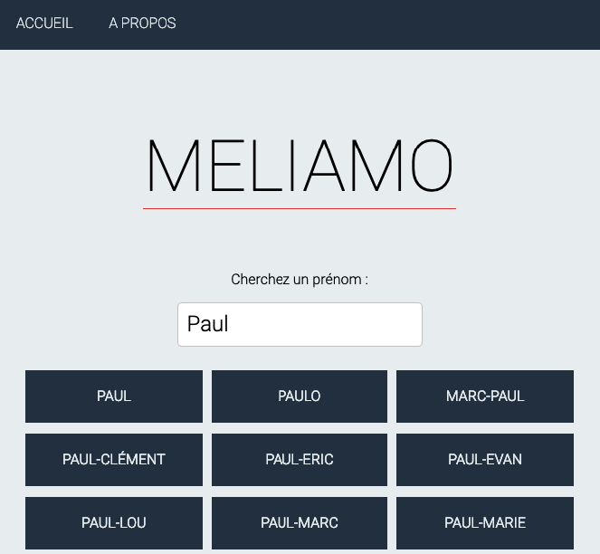
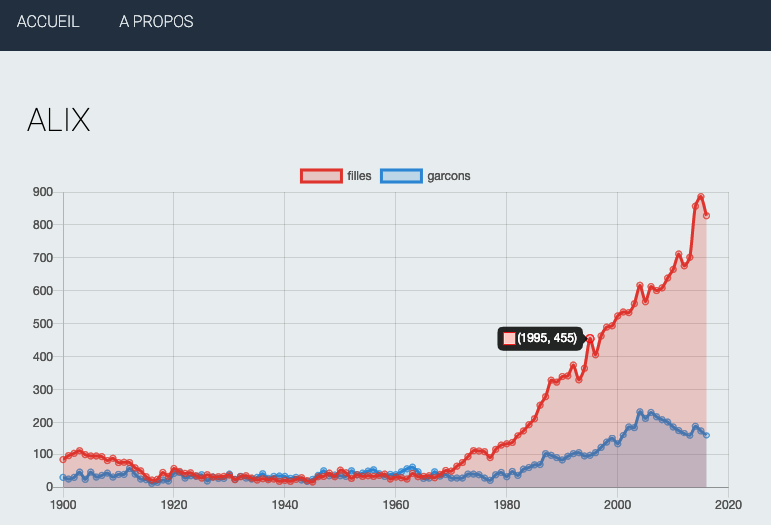

# MELIAMO

## French first name stat app. Find a firstname using the autocomplete field, select one first name and see number of births for male and female!

Technical stack: React + NodeJS + GraphQL + ElasticSearch 🚀

Autocomplete field uses an ElasticSearch cluster to retrieve suggestions based upon the [Levenshtein distance](https://en.wikipedia.org/wiki/Levenshtein_distance) (currently set to `2`).

### Homepage

`Search t=Marie, nb=21, lev=2 => 21 results (12 ms)`

### Stat screen

`Search t=Alix, nb=21, lev=2 => 21 results (10 ms)`
### [React Front-end](./client/)
### [NodeJS Express Back-end](./server/)
